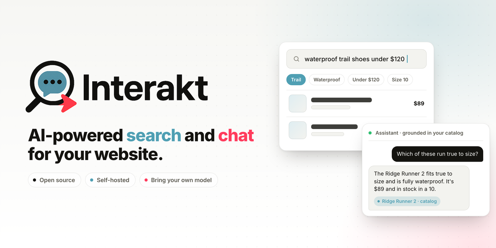
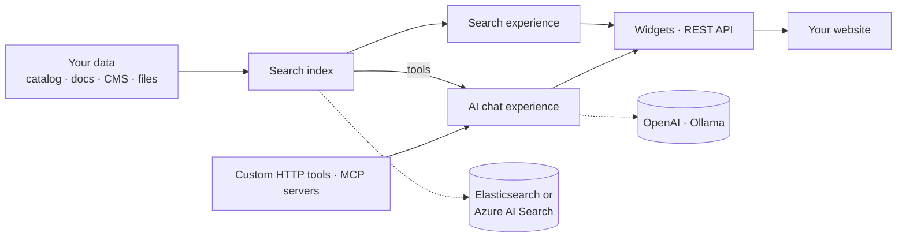

<div align="center">

<picture>
  <source media="(prefers-color-scheme: dark)" srcset=".github/assets/banner-dark.png">
  <source media="(prefers-color-scheme: light)" srcset=".github/assets/banner-light.png">
  
</picture>

<br>
<br>

[](https://github.com/alphasolutionsrepo/interakt/actions/workflows/ci.yml)
[](https://docs.interakt.app)
[](LICENSE)
[](.nvmrc)
[](backend/package.json)
[](CONTRIBUTING.md)

**Open-source, self-hosted search and AI chat for your website, grounded in your own data.**

[Website](https://interakt.app) · [Documentation](https://docs.interakt.app) · [API Reference](https://docs.interakt.app/api/) · [Integrations](https://docs.interakt.app/integrations/) · [Discussions](https://github.com/alphasolutionsrepo/interakt/discussions)

</div>

---

## What is Interakt?

Interakt puts a search box and a chat window in front of your users without you assembling the pieces yourself. Point it at your data, decide how it should behave in the admin dashboard, and paste a snippet into your site.

Underneath is a curated stack: a search engine, an AI provider, a chat pipeline, a versioned prompt library and an analytics database. You see one dashboard, one API and two widgets.

- **Search that understands intent.** Keyword, semantic or hybrid, with facets, synonyms, autocomplete and AI query understanding.
- **Chat that knows your data.** Answers are grounded in your indexes through tools, streamed, with optional citations, and kept on topic by guardrails.
- **Analytics that show what works.** Search events, chat sessions and execution traces land in a separate analytics database, with dashboards and an analytics assistant.

## See it in action

<table>
  <tr>
    <td width="34%" align="center" valign="top"><a href="https://www.youtube.com/watch?v=oxcFsP9UGiY"></a><br><sub><b>Backend setup</b><br>From <code>git clone</code> to localhost:3000</sub></td>
    <td width="33%" align="center" valign="top"><a href="https://www.youtube.com/watch?v=F6NcsVIett0"></a><br><sub><b>AI search and a sales assistant</b><br>Interakt on a Medusa storefront</sub></td>
    <td width="33%" align="center" valign="top"><a href="https://www.youtube.com/watch?v=HefUDrwq_Sw"></a><br><sub><b>Managing the integration</b><br>The admin side of the Medusa setup</sub></td>
  </tr>
</table>

## Highlights

<table>
  <tr>
    <td width="50%" valign="top">🔍 <b>Hybrid search</b><br>Keyword and vector results fused with reciprocal rank fusion, on Elasticsearch 9 or Azure AI Search. Facets, sorting, synonyms and stop words per index.</td>
    <td width="50%" valign="top">💬 <b>Grounded chat</b><br>A deterministic pipeline (plan → retrieve → synthesize) or an agentic loop, chosen per experience. Streaming responses, with optional inline or footnote citations.</td>
  </tr>
  <tr>
    <td valign="top">🧩 <b>Tools and MCP</b><br>Every index ships with search, lookup, inspect and enumerate tools. Add custom HTTP tools, or connect MCP servers over Streamable HTTP or SSE.</td>
    <td valign="top">🧠 <b>Bring your own model</b><br>OpenAI, OpenAI-compatible endpoints through a custom base URL, or Ollama for fully local inference. Choose the provider per experience.</td>
  </tr>
  <tr>
    <td valign="top">📦 <b>Drop-in widgets</b><br>Preact and Shadow DOM, loaded from a single script bundle. Search and chat widgets that work on any site, no framework required.</td>
    <td valign="top">📝 <b>Versioned prompts</b><br>Every pipeline step is an editable template with history and rollback. Tune behaviour without redeploying.</td>
  </tr>
  <tr>
    <td valign="top">🛡️ <b>Guardrails and credentials</b><br>Topic gating and greeting detection. Read-only public access tokens, server-side ingestion keys, and an encrypted secrets vault.</td>
    <td valign="top">🏠 <b>Self-hosted</b><br>One Docker image, Postgres with pgvector, and Elasticsearch or Azure AI Search. Runs wherever Docker runs; Alpha Solutions runs it on Azure Container Apps. MIT licensed.</td>
  </tr>
</table>

## How it fits together



You connect a data source, populate a search index, then build one or more experiences on top of it. The chat experience calls the search tools to answer from your data. The [architecture overview](https://docs.interakt.app/getting-started/architecture/) has the full picture.

## Quick start

Needs Node.js 24 and Docker. Prefer to watch? The [backend setup video](https://www.youtube.com/watch?v=oxcFsP9UGiY) walks through these steps.

```bash
git clone https://github.com/alphasolutionsrepo/interakt.git
cd interakt/backend

cp .env.example .env                                         # fill in the three generated secrets at the top
cp setup/setup.config.example.yaml setup/setup.config.yaml   # set your admin email and password

npm install
npm run infra:up     # Postgres (pgvector) and Elasticsearch in Docker
npm run dev          # migrates, seeds, creates the admin user → http://localhost:3000
```

Sign in and open **Platform → Initial Setup**. Connect an AI provider (Ollama is free and local), then load the **Fashion Catalog** demo: a populated index plus ready-made search and chat experiences with access tokens. Point the reference app in [`demo-site/`](demo-site/) at it, or embed the widget below.

The full walkthrough, scripts and bring-your-own-database notes are in [CONTRIBUTING.md](CONTRIBUTING.md#local-development). Hosting notes are in [backend/docker/](backend/docker/README.md).

## Embed it

```html
<div id="chat"></div>
<script src="https://your-interakt-host/embed/v1/widgets.js"></script>
<script>
  window.ChatDropinUI.init({
    containerId: 'chat',
    accessToken: '<access token from the admin UI>',
  });
</script>
```

Use `SearchDropinUI` for the search widget. The admin UI generates the exact snippet for each experience, and the [widget docs](https://docs.interakt.app/concepts/embed-widgets/) cover launcher modes, placement and theming.

## Or call the API

```bash
# Search through a search experience
curl -X POST https://your-interakt-host/api/v1/search/<experience-slug>/search \
  -H "Authorization: Bearer <access token>" \
  -H "Content-Type: application/json" \
  -d '{ "query": "waterproof trail shoes" }'

# Chat through an AI experience (streams server-sent events)
curl -N -X POST https://your-interakt-host/api/v1/ai-experiences/<experience-slug>/chat \
  -H "Authorization: Bearer <access token>" \
  -H "Content-Type: application/json" \
  -d '{ "message": "Which of these run true to size?" }'
```

Access tokens are issued per experience and are public and read-only by design. Writing documents into an index uses a server-side **ingestion key** instead. See the [search](https://docs.interakt.app/guides/call-the-search-api/), [chat](https://docs.interakt.app/guides/call-the-chat-api/) and [ingestion](https://docs.interakt.app/guides/ingestion-api-reference/) guides, or the full [API reference](https://docs.interakt.app/api/).

## Integrations

Step-by-step guides for [Medusa](https://docs.interakt.app/integrations/ecommerce/medusa/how-to-integrate-interakt-with-medusa/), [Storyblok](https://docs.interakt.app/integrations/cms-dxp/storyblok/how-to-integrate-interakt-with-storyblok/) and [React / Next.js](https://docs.interakt.app/integrations/frontend/react-nextjs/). The [Interakt-Medusa](https://github.com/alphasolutionsrepo/Interakt-Medusa) repository is the demo storefront that guide is built on.

## Repository layout

```
interakt/
├── backend/               Admin dashboard + REST APIs · Next.js 16, Drizzle, Postgres + pgvector
│   ├── widgets/           Embeddable search and chat widgets · Preact, built to public/embed/v1/widgets.js
│   ├── docker/            Production Dockerfile + local docker-compose (Postgres, pgAdmin, Elasticsearch)
│   └── src/content/docs/  The documentation, served in-app at /docs and published to docs.interakt.app
├── demo-site/             Reference consumer app on port 3001
└── docs-site/             Docusaurus + Redocusaurus shell for docs.interakt.app
```

## Contributing

Contributions are welcome. [CONTRIBUTING.md](CONTRIBUTING.md) covers local setup, conventions and how review works here. Found a bug or want a feature? [Open an issue](https://github.com/alphasolutionsrepo/interakt/issues/new/choose). Have a question? Start a [discussion](https://github.com/alphasolutionsrepo/interakt/discussions). For security issues, follow [SECURITY.md](SECURITY.md) and never open a public issue.

This project follows the [Contributor Covenant](CODE_OF_CONDUCT.md) code of conduct.

## License

[MIT](LICENSE) © [Alpha Solutions](https://www.alpha-solutions.com)
